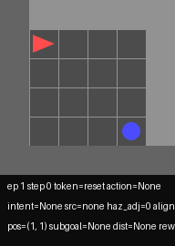
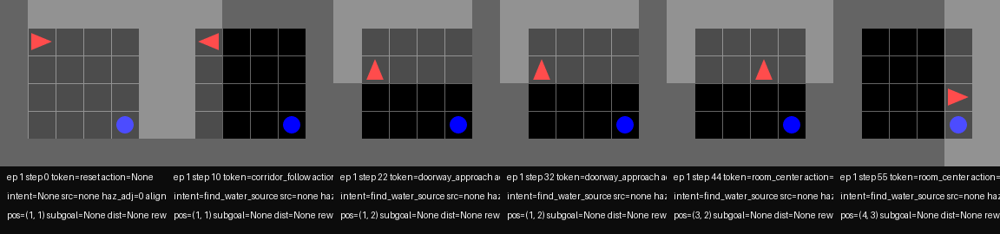
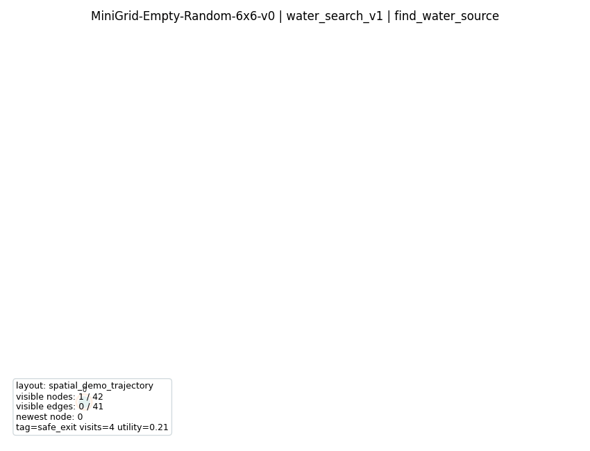
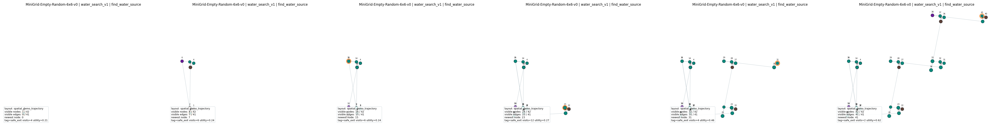
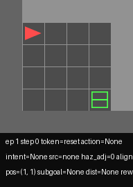
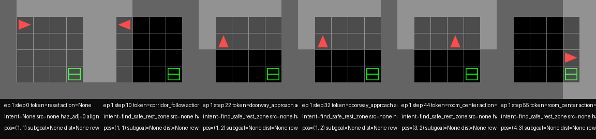
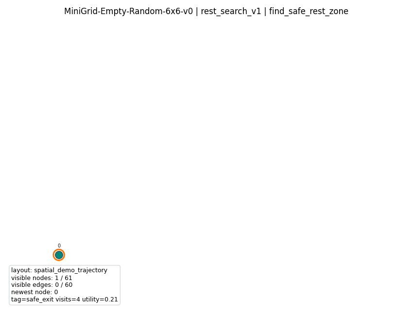
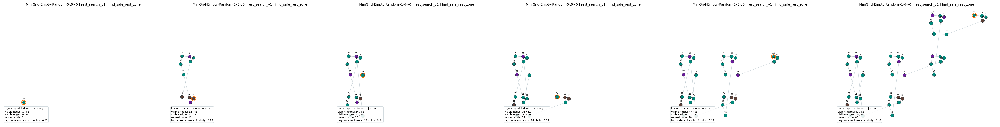

# Songlines

Songlines is a semantic place-selection layer built on top of a graph memory of visited places.

The current system no longer treats the target only as a known `goal_xy` coordinate. Instead, it can:
- extract semantic evidence from local observations,
- store semantic properties per graph node,
- choose targets by semantic intent,
- materialize planner-level target nodes and waypoints,
- switch intents from internal state such as `thirst` and `energy`.

In short, the method now supports:

`AgentState -> Intent -> Semantic predicate -> Graph target -> Waypoint -> Action`

This repository started from the Active Neural SLAM codebase, but the active working line here is the Songlines semantic-intention stack.

## Current Milestone

The current milestone is:

`semantic_place_selection_v1`

This milestone is already working end-to-end for two semantic tasks:
- `FIND_WATER_SOURCE`
- `FIND_SAFE_REST_ZONE`

What is now validated:
- semantic evidence extraction in `scene_encoder`
- semantic tag generation in `scene_tokenizer`
- graph memory with `semantic_tag_counts` and `semantic_tag_confidence`
- intent-conditioned graph retrieval
- planner-level target materialization
- state-conditioned activation for semantic search
- task success not tied only to `goal_xy`

## How The Method Works

The method has five layers.

1. **Perception**

`songline_drive/scene_encoder.py` converts the local MiniGrid observation into geometric and semantic evidence:
- hazard / safe / corridor / room-center / goal-region features
- water evidence:
  - `water_visible`
  - `water_pattern_match`
  - `water_accessible`
  - `water_neighbor_context`
  - `water_confidence_local`
- rest evidence:
  - `rest_visible`
  - `rest_pattern_match`
  - `rest_accessible`
  - `rest_neighbor_context`
  - `rest_confidence_local`

2. **Tokenization**

`songline_drive/scene_tokenizer.py` turns scene evidence into:
- route / phase token
- semantic place tags such as:
  - `safe_exit`
  - `goal_region`
  - `hazard_edge`
  - `room_center`
  - `corridor`
  - `hazard_recovery_route`
  - `water_source`
  - `water_candidate`
  - `water_nearby`
  - `safe_rest_zone`
  - `rest_candidate`
  - `rest_nearby`

3. **Semantic Graph Memory**

`songline_drive/graph_memory.py` stores a graph of recurring places.

Each node accumulates:
- visits
- utility
- risk / progress traces
- semantic evidence:
  - `semantic_tag_counts`
  - `semantic_tag_confidence`

So the memory is not just “where the agent has been”. It is also “what kind of place this node appears to be”.

4. **Intent-Conditioned Retrieval**

`songline_drive/intents.py` defines semantic planner queries.

Examples:
- `FIND_WATER_SOURCE`
- `FIND_SAFE_REST_ZONE`
- `FIND_GOAL_REGION`
- `REACH_SAFE_EXIT`

These are implemented as semantic predicates and weighted retrieval scores over graph nodes, not as planner special-cases.

5. **State-Gated Intent Selection**

`songline_drive/agent_state.py` can activate search behavior from internal state:
- `thirst` can activate water search
- `energy` can activate rest-zone search

The planner/controller layer is reused across tasks. It is not rewritten separately for water or rest.

## What Was Added

The active Songlines additions include:
- semantic graph memory over place nodes
- intent-conditioned planner queries
- water task as a real semantic retrieval task
- rest-zone task as a second semantic retrieval task
- state-conditioned activation for both tasks
- graph-growth visualization over the agent trajectory

Important modules:
- [songline_drive/types.py](./songline_drive/types.py)
- [songline_drive/intents.py](./songline_drive/intents.py)
- [songline_drive/scene_encoder.py](./songline_drive/scene_encoder.py)
- [songline_drive/scene_tokenizer.py](./songline_drive/scene_tokenizer.py)
- [songline_drive/graph_memory.py](./songline_drive/graph_memory.py)
- [songline_drive/agent_state.py](./songline_drive/agent_state.py)
- [scripts/songline_minigrid.py](./scripts/songline_minigrid.py)
- [scripts/compare_songline_minigrid.py](./scripts/compare_songline_minigrid.py)
- [scripts/visualize_songline_graph_growth.py](./scripts/visualize_songline_graph_growth.py)

## Semantic Tasks

### 1. Water Search

Water is the first full semantic task:
- target is not given as `goal_xy`
- water is represented as semantic evidence
- memory stores water-like places
- planner can retrieve a water target node
- execution goes through waypoint / graph path

There are two main modes:
- fixed water intent
- state-conditioned water intent

### 2. Safe Rest Zone Search

Rest search is the second semantic task:
- different task semantics
- same pipeline
- same planner/controller stack

This is important because it shows the method is not a water-specific hack. It is a general semantic place-selection pipeline.

## Main Results

### Water Full Compare

Artifacts:
- [summary_table.csv](./tmp/benchmark_water_semantic_full/summary_table.csv)
- [aggregate_by_env.csv](./tmp/benchmark_water_semantic_full/aggregate_by_env.csv)
- [songline_graph_growth.png](./tmp/benchmark_water_semantic_full/songline_graph_growth.png)

Overall:

| Method | Success | Avg Steps | Avg Return |
|---|---:|---:|---:|
| fixed water | 0.5025 | 34.4150 | 0.5025 |
| state-conditioned water v1 | 0.4875 | 42.1675 | 0.4875 |
| state-conditioned water v2 | 0.5025 | 34.4150 | 0.5025 |

Interpretation:
- `state_v1` activated too late
- evidence-aware `state_v2` recovered parity with fixed semantic water retrieval

### Rest Full Compare

Artifacts:
- [summary_table.csv](./tmp/benchmark_rest_semantic_full/summary_table.csv)
- [aggregate_by_env.csv](./tmp/benchmark_rest_semantic_full/aggregate_by_env.csv)
- [songline_graph_growth.png](./tmp/benchmark_rest_semantic_full/songline_graph_growth.png)

Overall:

| Method | Success | Avg Steps | Avg Return |
|---|---:|---:|---:|
| fixed rest | 0.5000 | 34.9525 | 0.5000 |
| state-conditioned rest v1 | 0.4900 | 42.0825 | 0.4900 |
| state-conditioned rest v2 | 0.5125 | 36.3225 | 0.5125 |

Interpretation:
- the second semantic task works on the same stack
- evidence-aware `state_v2` gives a small gain over fixed rest on this benchmark

## Visual Demos

### Water: State-Conditioned Semantic Retrieval

Agent walkthrough:



Storyboard:



Artifacts:
- [demo.gif](./tmp/demo_water_state_v2_seed3/demo/demo.gif)
- [storyboard.png](./tmp/demo_water_state_v2_seed3/demo/storyboard.png)
- [demo_metadata.json](./tmp/demo_water_state_v2_seed3/demo/demo_metadata.json)
- [summary.json](./tmp/demo_water_state_v2_seed3/summary.json)

### Water: Graph Growth In Space

This visualization shows graph nodes appearing in the spatial order of the agent trajectory rather than in an abstract line layout.



Storyboard:



Artifacts:
- [graph_growth.gif](./tmp/demo_water_state_v2_seed3/graph_growth_viz/graph_growth.gif)
- [graph_growth_storyboard.png](./tmp/demo_water_state_v2_seed3/graph_growth_viz/graph_growth_storyboard.png)
- [graph_growth_final.png](./tmp/demo_water_state_v2_seed3/graph_growth_viz/graph_growth_final.png)
- [graph_growth_metadata.json](./tmp/demo_water_state_v2_seed3/graph_growth_viz/graph_growth_metadata.json)

### Rest: State-Conditioned Semantic Retrieval

Agent walkthrough:



Storyboard:



Artifacts:
- [demo.gif](./tmp/demo_rest_state_v2_seed3/demo/demo.gif)
- [storyboard.png](./tmp/demo_rest_state_v2_seed3/demo/storyboard.png)
- [demo_metadata.json](./tmp/demo_rest_state_v2_seed3/demo/demo_metadata.json)
- [summary.json](./tmp/demo_rest_state_v2_seed3/summary.json)

### Rest: Graph Growth In Space



Storyboard:



Artifacts:
- [graph_growth.gif](./tmp/demo_rest_state_v2_seed3/graph_growth_viz/graph_growth.gif)
- [graph_growth_storyboard.png](./tmp/demo_rest_state_v2_seed3/graph_growth_viz/graph_growth_storyboard.png)
- [graph_growth_final.png](./tmp/demo_rest_state_v2_seed3/graph_growth_viz/graph_growth_final.png)
- [graph_growth_metadata.json](./tmp/demo_rest_state_v2_seed3/graph_growth_viz/graph_growth_metadata.json)

## Why This Matters

The key result is no longer just “the agent can reach a coordinate”.

The current method shows:
- semantic evidence can be extracted from the environment
- place hypotheses can be accumulated in graph memory
- planner targets can be selected by semantic intent
- state can gate which semantic place the agent should seek

This means the method now supports:

“choose and reach a place defined by semantic pattern, not by a known coordinate”

That is the main claim of the current Songlines line.

## Reproducing The Current Milestone

### Water Compare

```bash
PYTHONPATH=. .venv/bin/python scripts/compare_songline_minigrid.py \
  --env_ids MiniGrid-Empty-Random-6x6-v0 MiniGrid-FourRooms-v0 \
  --methods milestone_semantic_intent_water_v1 milestone_state_conditioned_water_v1 milestone_state_conditioned_water_v2 \
  --num_seeds 10 \
  --episodes 20 \
  --max_steps 60 \
  --scene_radius 1 \
  --graph_rollout_horizon 4 \
  --task_mode water_search_v1 \
  --out_dir /Users/taniyashuba/PycharmProjects/Songlines/tmp/benchmark_water_semantic_full
```

### Rest Compare

```bash
PYTHONPATH=. .venv/bin/python scripts/compare_songline_minigrid.py \
  --env_ids MiniGrid-Empty-Random-6x6-v0 MiniGrid-FourRooms-v0 \
  --methods milestone_semantic_intent_rest_v1 milestone_state_conditioned_rest_v1 milestone_state_conditioned_rest_v2 \
  --num_seeds 10 \
  --episodes 20 \
  --max_steps 60 \
  --scene_radius 1 \
  --graph_rollout_horizon 4 \
  --task_mode rest_search_v1 \
  --out_dir /Users/taniyashuba/PycharmProjects/Songlines/tmp/benchmark_rest_semantic_full
```

### Spatial Graph Growth Visualization

```bash
PYTHONPATH=. .venv/bin/python scripts/visualize_songline_graph_growth.py \
  --run_dir /Users/taniyashuba/PycharmProjects/Songlines/tmp/demo_water_state_v2_seed3 \
  --env_idx 0 \
  --max_frames 32
```

## Current Status

What is already done:
- semantic graph memory
- planner-level semantic retrieval
- concept-level recall and concept-level planning
- state-conditioned semantic activation
- two working semantic tasks
- spatial graph-growth visualization
- observation-space integrity fix for task wrappers
- MiniWorld integration layer for 3D semantic-place evaluation

What is the next likely step:
- a third semantic place task
- then multi-agent semantic coordination on top of the same intent/memory stack

## MiniWorld Stage

The next environment family after MiniGrid is now implemented:
- `MiniWorld-Hallway-v0`
- `MiniWorld-TMaze-v0`
- `MiniWorld-WallGap-v0`
- `MiniWorld-FourRooms-v0`

Implemented files:
- [songline_drive/miniworld_support.py](./songline_drive/miniworld_support.py)
- [scripts/songline_miniworld.py](./scripts/songline_miniworld.py)
- [scripts/compare_songline_miniworld.py](./scripts/compare_songline_miniworld.py)

What is already done in this stage:
- 3D MiniWorld scene adaptation into `SceneState`
- reuse of the same semantic graph memory and `SymbolicMemory`
- reuse of `node_only`, `concept_recall_v1`, `concept_plan_v1`
- continuous waypoint grounding for MiniWorld node targets

What is not yet validated on this machine:
- full MiniWorld smoke-run
- full MiniWorld benchmark

Reason:
- the Python layer is implemented and `miniworld` is installed
- but runtime is currently blocked by the system OpenGL backend
- `scripts/songline_miniworld.py --check_dependencies` currently reports:

```json
{
  "miniworld_available": true,
  "miniworld_runtime_usable": false,
  "runtime_error": "Library \"EGL\" not found."
}
```

This means the current blocker is environment-side, not Songlines-side.

### MiniWorld Commands

List supported MiniWorld envs:

```bash
PYTHONPATH=. .venv/bin/python scripts/songline_miniworld.py --list_envs
```

Check whether MiniWorld can actually run in the current machine:

```bash
PYTHONPATH=. .venv/bin/python scripts/songline_miniworld.py --check_dependencies
```

Hallway smoke-run once EGL or a working display is available:

```bash
PYTHONPATH=. .venv/bin/python scripts/songline_miniworld.py \
  --env_id MiniWorld-Hallway-v0 \
  --agent_mode songline \
  --songline_policy graph_path \
  --token_source scene_semantic \
  --intent_mode goal_region_v1 \
  --intent_type find_goal_region \
  --semantic_retrieval_mode concept_plan_v1 \
  --episodes 2 \
  --max_steps 120 \
  --seed 3 \
  --out_dir /Users/taniyashuba/PycharmProjects/Songlines/tmp/miniworld_hallway_smoke
```

Full MiniWorld compare once runtime is usable:

```bash
PYTHONPATH=. .venv/bin/python scripts/compare_songline_miniworld.py \
  --env_ids MiniWorld-Hallway-v0 MiniWorld-TMaze-v0 MiniWorld-WallGap-v0 MiniWorld-FourRooms-v0 \
  --methods random greedy miniworld_goal_region_node_v1 miniworld_goal_region_concept_v1 miniworld_goal_region_plan_v1 \
  --episodes 20 \
  --max_steps 120 \
  --num_seeds 10 \
  --out_dir /Users/taniyashuba/PycharmProjects/Songlines/tmp/benchmark_miniworld_semantic_full
```

### MiniWorld Runtime Checklist

Before running MiniWorld benchmark or demo:
1. `miniworld` must be installed in `.venv`.
2. `scripts/songline_miniworld.py --check_dependencies` must report `miniworld_runtime_usable = true`.
3. The machine must provide either:
   - a working display-backed OpenGL context, or
   - an EGL-compatible headless backend.
4. Start with `MiniWorld-Hallway-v0` smoke-run before any full compare.
5. Only then run the 4-env compare.

## Additional Documentation

See also:
- [docs/README_songline_repo.md](./docs/README_songline_repo.md)
- [docs/AGENT_PROMPT_songline_repo.md](./docs/AGENT_PROMPT_songline_repo.md)
- [docs/GOALS_semantic_intention_water.md](./docs/GOALS_semantic_intention_water.md)
- [docs/INSTRUCTIONS.md](./docs/INSTRUCTIONS.md)

## Original Base Repository

This repository originated from the Active Neural SLAM codebase:

[Learning To Explore Using Active Neural SLAM](https://openreview.net/pdf?id=HklXn1BKDH)  
Devendra Singh Chaplot, Dhiraj Gandhi, Saurabh Gupta, Abhinav Gupta, Ruslan Salakhutdinov

The original implementation details are no longer the best description of the active Songlines work, but the base repository attribution remains important.
